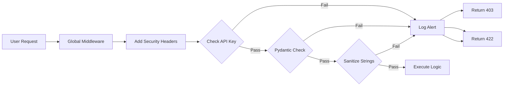

# 🔐 Cybersecurity Architecture & Implementation

This document details the security layers implemented in the Smart Parking System to protect against common web vulnerabilities like Unauthorized Access, Injection Attacks, and Data Tampering.

---

## 1. API Key Authentication (Identity & Access Management)
**Threat Mitigated:** Unauthorized Access / Brute Force
**Implementation:** `verify_api_key` Dependency

*   **Logic:** Every sensitive API request (Entry, Exit, Simulation) must include a custom header `X-API-KEY`.
*   **Behavior:**
    *   The system compares the header value against the server's `SECRET_KEY`.
    *   If missing or incorrect, the request is rejected immediately with **HTTP 403 Forbidden**.
    *   The attempt is logged by the IDS.

```python
async def verify_api_key(request: Request, x_api_key: str = Header(None)):
    if x_api_key != SECRET_KEY:
        ids.log_event(ip, "Invalid API Key", severity="HIGH")
        raise HTTPException(status_code=403, detail="Unauthorized")
```

---

## 2. Strict Input Validation (Data Integrity)
**Threat Mitigated:** Malformed Data / Logic Errors / Buffer Overflows
**Implementation:** Pydantic Models (`VehicleEntryModel`, etc.)

*   **Logic:** All incoming JSON payloads are validated against strict schemas before processing.
*   **Rules Enforced:**
    *   **Type Safety:** `duration` must be a float, `slot` must be an int.
    *   **Range Checks:** `duration > 0`, `1 <= slot <= 12`.
    *   **Enum Constraints:** `vehicle_type` must be one of ["VIP", "NORMAL", ...].
*   **Outcome:** Invalid data triggers **HTTP 422 Unprocessable Entity**.

---

## 3. Input Sanitization (Injection Prevention)
**Threat Mitigated:** Cross-Site Scripting (XSS) / Command Injection
**Implementation:** `sanitize_string` Helper

*   **Logic:** Scans string inputs for dangerous characters often used in attacks.
*   **Blacklist:** `< > { } $ script \`
*   **Behavior:** If a forbidden character is found (e.g., `<script>`), the request is rejected.

```python
def sanitize_string(text: str):
    forbidden = ["<", ">", "{", "}", "$", "script"]
    for f in forbidden:
        if f in text: raise ValueError("Invalid characters")
```

---

## 4. Security Hardening Headers (Middleware)
**Threat Mitigated:** Clickjacking / MIME Sniffing
**Implementation:** Global Middleware

*   **Logic:** Intercepts every outgoing response to inject security headers.
*   **Headers Added:**
    *   `X-Frame-Options: DENY` - Prevents the site from being embedded in iframes (stops Clickjacking).
    *   `X-Content-Type-Options: nosniff` - Forces browser to respect declared Content-Type (stops MIME sniffing attacks).

---

## 5. Intrusion Detection System (IDS) (Monitoring)
**Threat Mitigated:** Stealthy Attacks / Reconnaissance
**Implementation:** `IntrusionDetectionSystem` Class

*   **Logic:** A centralized logger that tracks security exceptions.
*   **Events Logged:**
    *   Failed Authentication (Severity: HIGH)
    *   Validation Errors (Severity: MEDIUM)
    *   Business Logic Errors (Severity: LOW)
*   **Output:** Prints timestamped alerts to the server console for admin review.

---

## 6. Secret Management (Configuration Security)
**Threat Mitigated:** Credential Leakage
**Implementation:** `python-dotenv`

*   **Logic:** Sensitive keys are **never** hardcoded in the source code.
*   **Storage:** Keys are stored in a `.env` file (which is typically git-ignored).
*   **Loading:** The application loads `SECRET_KEY` into memory at runtime.

---

## 🛡️ Security Flowchart


