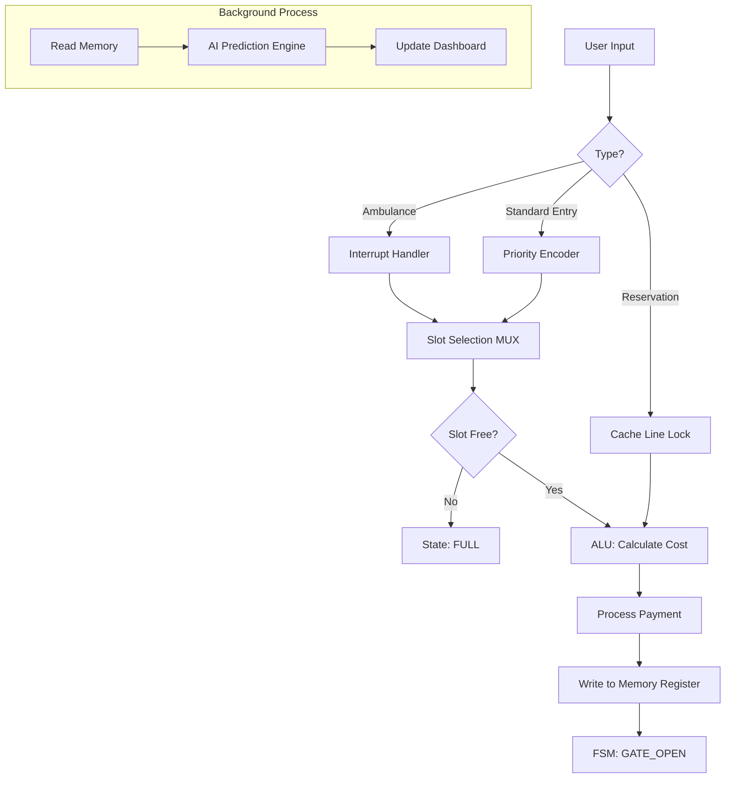

# 🅿️ Smart Parking AI System - DDCO Project

## 🎯 Project Overview

This project is a **Smart Parking Management System** that bridges the gap between **Digital Design & Computer Organization (DDCO)** concepts and modern software engineering. 

It simulates a hardware-based parking controller using Python (FastAPI), implementing components like **ALUs, Priority Encoders, Finite State Machines (FSM), and Cache Locking** to manage a real-time parking lot with AI-based availability prediction.

---

## 🧠 DDCO Concepts Implemented

### 1. **Arithmetic Logic Unit (ALU) - Billing System**
*   **Concept:** The ALU performs arithmetic operations (Addition, Multiplication) in a CPU.
*   **Implementation:** The `BillingALU` class calculates parking fees based on vehicle type rates and duration.
*   **Logic:** `Cost = Rate(Type) × Duration`
*   **Feature:** Upfront billing calculation before slot assignment.

### 2. **Priority Encoder & Interrupts - Vehicle Entry**
*   **Concept:** A circuit that converts multiple input requests into a binary output based on priority.
*   **Implementation:** The `PriorityEncoder` class assigns levels to vehicle types.
*   **Hierarchy:**
    1.  🚑 **AMBULANCE** (Priority 0) - **Interrupt Handler** (Overrides everything)
    2.  👑 **VIP** (Priority 1)
    3.  ⚡ **EV** (Priority 2)
    4.  👴 **SENIOR** (Priority 3)
    5.  🚗 **NORMAL** (Priority 4)

### 3. **Finite State Machine (FSM) - Control Unit**
*   **Concept:** A sequential circuit that transitions between states based on inputs.
*   **Implementation:** The system tracks the parking lifecycle:
    *   `IDLE` → Waiting for input
    *   `ALLOCATE` → Finding best slot
    *   `GATE_OPEN` → Processing entry
    *   `FULL` → Error state

### 4. **Multiplexer (MUX) - Slot Selection**
*   **Concept:** Selects one output line from multiple input lines based on selection signals.
*   **Implementation:** The `_find_best_slot` function acts as a MUX, selecting the specific slot ID based on:
    *   **Select Signal A:** Vehicle Type (e.g., EV needs Charging Slot)
    *   **Select Signal B:** **Traffic Mode** (Manual/Peak/Event) - Controls overflow logic (e.g., Normal cars using VIP slots).
    *   **Select Signal C:** Availability (Empty/Occupied)

### 5. **Cache Line Locking - Slot Reservation**
*   **Concept:** Locking a cache line to prevent it from being evicted or overwritten.
*   **Implementation:** The **Reservation System** "locks" a specific slot address in memory.
*   **Behavior:** Standard allocation logic (MUX) skips these locked slots, preserving them for the specific user.

### 6. **Pipelining & Branch Prediction - AI Engine**
*   **Concept:** Fetching and processing instructions ahead of time to improve performance.
*   **Implementation:** The `PredictionEngine` runs concurrently to forecast future slot availability.
*   **Logic:** It analyzes the `end_time` stored in memory registers to predict exactly when a slot will become free (e.g., "Free at 14:30").

### 7. **Memory Registers - Slot Storage**
*   **Concept:** Fast storage units for holding temporary data.
*   **Implementation:** The `self.slots` dictionary acts as a register file, storing:
    *   `Vehicle ID`
    *   `Type`
    *   `Entry Time`
    *   `End Time` (for prediction)

---

## 💻 Web Interface Guide

The User Interface is designed to act as the **I/O (Input/Output) Unit** of the system, now featuring **Real-Time AJAX Updates** (no page reloads).

> 📘 **Detailed Guide:** For a complete walkthrough of the dashboard, see the [User Guide](EXTRA/USER_GUIDE.md).

### 1. Control Panel (Center - Input Unit)
*   **System Mode Selector:** Switches the Control Unit logic:
    *   **MANUAL:** Strict slot matching.
    *   **PEAK:** Allows **Normal** cars to overflow into **VIP** slots.
    *   **EVENT:** Allows **VIP** cars to overflow into **Normal** slots.
*   **Duration Input:** Set how long you want to park (inputs data to ALU).
*   **Vehicle Buttons:** Acts as hardware interrupt signals. Clicking "Ambulance" triggers high-priority logic.

### 2. Simulation Panel (Right - Automation)
*   **Robot Controls:** Start/Pause the FSM clock.
*   **Queue Management:** Add cars to the Shift Register (Queue) or use **Undo** to remove the last entry.
*   **Robot Status:** Visualizes the FSM state (IDLE/MOVING/PARKING) of Robots 1, 2, and 3.

### 3. AI Forecast Panel (Left - Pipelining Output)
*   **Probability Gauge:** Shows the likelihood of finding a spot.
*   **Upcoming Availability:** Lists exactly when occupied slots will free up (e.g., "Slot 3 free in 15 mins").

### 4. Live Slot Grid (Register View)
*   **Visual Feedback:**
    *   🟩 **Green:** Available (Empty Register)
    *   🟥 **Red:** Occupied (Data Stored) - Shows "Auto-Parked" vs "Manual".
    *   🟨 **Yellow:** Locked/Reserved (Cache Locked)
    *   🔵 **Blue Pulse:** Robot Incoming (Cache Lock)
*   **Details:** Shows vehicle type, icon, and "Free at HH:MM" time.

---

## 🗺️ System Flowchart



## ⚙️ How It Works (Technical Workflow)

The system follows a strict **Input-Process-Output** cycle, mimicking a hardware controller:

1.  **Input (Frontend & API):**
    *   User triggers an action via the Web UI.
    *   **Security Check:** The request is intercepted. The `X-API-KEY` header is verified.
    *   **Validation:** The JSON payload is checked against Pydantic models (e.g., ensuring positive duration).
    *   **Sanitization:** Inputs are scanned for script tags to prevent injection attacks.

2.  **Process (Controller Logic):**
    *   **Priority Encoder:** The vehicle type is converted to a priority level (0-4).
    *   **MUX (Slot Selection):** The system scans memory (`self.slots`) for a free spot matching the type and current **Traffic Mode** (Manual/Peak/Event).
    *   **ALU (Billing):** If a slot is found, the cost is calculated: `Rate * Duration`.
    *   **FSM (Robots):** If in simulation mode, a Robot agent transitions states (`IDLE` -> `MOVING` -> `PARKING`) to physically "move" the data to the slot.

3.  **Output (Memory & UI):**
    *   **Write Back:** The vehicle data is written to the specific Slot ID in the `slots` dictionary.
    *   **Feedback:** The UI receives a JSON response and updates the Grid and Charts via AJAX.

---

## 🔧 Installation & Run

1.  **Install Dependencies:**
    ```bash
    pip install fastapi uvicorn jinja2 python-multipart python-dotenv
    ```

2.  **Run the System:**
    ```bash
    python main.py
    ```

3.  **Access Dashboard:**
    Open your browser and go to: `http://localhost:8000`

---

## 🧰 Tech Stack (Detailed)

This project uses a lightweight, modern stack focused on Python backend APIs, a minimal templated frontend, and simple tooling for local development and optional containerized deployment.

- Language
  - Python 3.10+ (recommended). Used for all backend logic, simulation, AI prediction logic and FSM/ALU emulation.

- Backend
  - FastAPI — ASGI web framework that exposes the REST endpoints and serves the Jinja2 HTML templates. Handles form submissions, JSON APIs, and server events.
  - Uvicorn — ASGI server for running the FastAPI app in development and production.

- Templating & Frontend
  - Jinja2 — Server-side HTML templating (templates/index.html).
  - Vanilla HTML/CSS/JavaScript — Lightweight UI; no SPA framework required.
  - Chart.js — Client-side charting used to visualize prediction probabilities.
  - Font Awesome — Iconography for UI elements.

- Dependencies (Python packages)
  - fastapi
  - uvicorn
  - jinja2
  - python-multipart (for form handling)
  - (Optional for production) gunicorn + uvicorn workers, or an ASGI process manager.

- Development Tools
  - pip — Python package installer.
  - git — Source control.
  - Optional: Docker & docker-compose for containerized runs.

- Recommended Versions / Commands
  - Python: 3.10 or newer
  - Install deps:
    ```bash
    python -m pip install -r requirements.txt
    # or
    pip install fastapi uvicorn jinja2 python-multipart
    ```
  - Run locally:
    ```bash
    python main.py
    # or
    uvicorn main:app --reload
    ```
  - Build & run with Docker (optional):
    - Create a simple Dockerfile that installs Python, copies project files, installs requirements, and runs uvicorn.
    - docker build -t ddco-parking .
    - docker run -p 8000:8000 ddco-parking

- Roles & Where They Live in the Repo
  - controller.py — Core simulation, ALU (billing), Priority Encoder, PredictionEngine, FSM logic and slot memory register.
  - main.py — FastAPI routes that wire UI forms and AJAX endpoints to ParkingLot methods.
  - templates/index.html — UI, AJAX handlers, Chart.js integration and visualization of registers/robots/queue.
  - README.md — Project overview, installation and this tech stack documentation.

- Notes & Best Practices
  - Keep long-running or CPU-heavy prediction logic separate (e.g., background tasks or a separate worker) if you scale beyond a single process.
  - Use uvicorn/gunicorn with multiple workers behind a reverse proxy (nginx) for production.
  - Pin package versions in requirements.txt for reproducible installs.
  - Consider adding a lightweight REST test suite (pytest + httpx) to validate API contract.

---

## 🚀 Future Scope

*   **FPGA Integration:** Port the Python logic to Verilog/VHDL.
*   **IoT Sensors:** Replace manual button inputs with IR sensors.
*   **License Plate Recognition:** Automated input using Image Processing.

---

## 🛡️ Security Testing

To verify that the **API Key Authentication** and **Input Validation** modules are active:

> 🔐 **Deep Dive:** Read the full [Cybersecurity Implementation Guide](EXTRA/SECURITY_IMPLEMENTATION.md) to understand the 6 layers of defense (Auth, IDS, Sanitization, etc.).

1.  Ensure the server is running:
    ```bash
    python main.py
    ```
2.  Open a new terminal and run the security test script (No extra dependencies required):
    ```bash
    python test_security.py
    ```

**Expected Output:**
*   ✅ **PASS:** Auth Check: Missing Header (403 Forbidden)
*   ✅ **PASS:** Auth Check: Wrong Key (403 Forbidden)
*   ✅ **PASS:** Validation: Negative Duration (422 Unprocessable Entity)
*   ✅ **PASS:** Sanitization: Script Injection (422 Unprocessable Entity)
*   ✅ **PASS:** Valid Request: Normal Entry (200 OK)

### 📊 Understanding the Status Codes
*   **HTTP 403 (Forbidden):** 🛑 **Security Block.** The system successfully rejected a request with a missing or wrong API Key.
*   **HTTP 422 (Unprocessable Entity):** 🛡️ **Validation Block.** The system successfully rejected invalid data (e.g., negative time) or malicious inputs (scripts).
*   **HTTP 200 (OK):** ✅ **Success.** The request passed all security checks and was processed.

*Note: Seeing "403" or "422" in the logs means the security system is **working** and blocking bad requests.*

---

**Course:** Digital Design and Computer Organization (DDCO)  
*Built with ❤️ using Digital Logic Principles*
