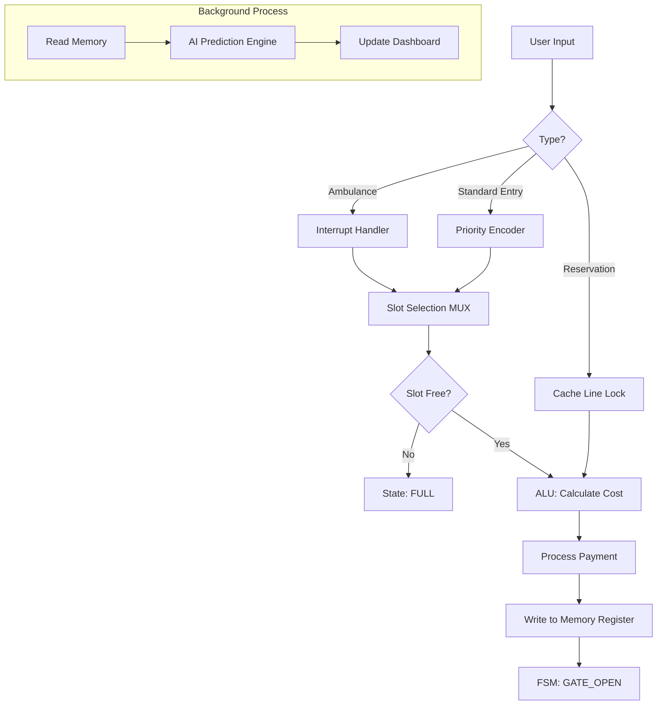

# 🅿️ Smart Parking AI System - DDCO Project

## 🎯 Project Overview

This project is a **Smart Parking Management System** that bridges the gap between **Digital Design & Computer Organization (DDCO)** concepts and modern software engineering. 

It simulates a hardware-based parking controller using Python (FastAPI), implementing components like **ALUs, Priority Encoders, Finite State Machines (FSM), and Cache Locking** to manage a real-time parking lot with AI-based availability prediction.

---

## 🧠 DDCO Concepts Implemented

### 1. **Arithmetic Logic Unit (ALU) - Billing System**
*   **Concept:** The ALU performs arithmetic operations (Addition, Multiplication) in a CPU.
*   **Implementation:** The `BillingALU` class calculates parking fees based on vehicle type rates and duration.
*   **Logic:** `Cost = Rate(Type) × Duration`
*   **Feature:** Upfront billing calculation before slot assignment.

### 2. **Priority Encoder & Interrupts - Vehicle Entry**
*   **Concept:** A circuit that converts multiple input requests into a binary output based on priority.
*   **Implementation:** The `PriorityEncoder` class assigns levels to vehicle types.
*   **Hierarchy:**
    1.  🚑 **AMBULANCE** (Priority 0) - **Interrupt Handler** (Overrides everything)
    2.  👑 **VIP** (Priority 1)
    3.  ⚡ **EV** (Priority 2)
    4.  👴 **SENIOR** (Priority 3)
    5.  🚗 **NORMAL** (Priority 4)

### 3. **Finite State Machine (FSM) - Control Unit**
*   **Concept:** A sequential circuit that transitions between states based on inputs.
*   **Implementation:** The system tracks the parking lifecycle:
    *   `IDLE` → Waiting for input
    *   `ALLOCATE` → Finding best slot
    *   `GATE_OPEN` → Processing entry
    *   `FULL` → Error state

### 4. **Multiplexer (MUX) - Slot Selection**
*   **Concept:** Selects one output line from multiple input lines based on selection signals.
*   **Implementation:** The `_find_best_slot` function acts as a MUX, selecting the specific slot ID based on:
    *   **Select Signal A:** Vehicle Type (e.g., EV needs Charging Slot)
    *   **Select Signal B:** **Traffic Mode** (Manual/Peak/Event) - Controls overflow logic (e.g., Normal cars using VIP slots).
    *   **Select Signal C:** Availability (Empty/Occupied)

### 5. **Cache Line Locking - Slot Reservation**
*   **Concept:** Locking a cache line to prevent it from being evicted or overwritten.
*   **Implementation:** The **Reservation System** "locks" a specific slot address in memory.
*   **Behavior:** Standard allocation logic (MUX) skips these locked slots, preserving them for the specific user.

### 6. **Pipelining & Branch Prediction - AI Engine**
*   **Concept:** Fetching and processing instructions ahead of time to improve performance.
*   **Implementation:** The `PredictionEngine` runs concurrently to forecast future slot availability.
*   **Logic:** It analyzes the `end_time` stored in memory registers to predict exactly when a slot will become free (e.g., "Free at 14:30").

### 7. **Memory Registers - Slot Storage**
*   **Concept:** Fast storage units for holding temporary data.
*   **Implementation:** The `self.slots` dictionary acts as a register file, storing:
    *   `Vehicle ID`
    *   `Type`
    *   `Entry Time`
    *   `End Time` (for prediction)

---

## 💻 Web Interface Guide

The User Interface is designed to act as the **I/O (Input/Output) Unit** of the system, now featuring **Real-Time AJAX Updates** (no page reloads).

### 1. Control Panel (Center - Input Unit)
*   **System Mode Selector:** Switches the Control Unit logic:
    *   **MANUAL:** Strict slot matching.
    *   **PEAK:** Allows **Normal** cars to overflow into **VIP** slots.
    *   **EVENT:** Allows **VIP** cars to overflow into **Normal** slots.
*   **Duration Input:** Set how long you want to park (inputs data to ALU).
*   **Vehicle Buttons:** Acts as hardware interrupt signals. Clicking "Ambulance" triggers high-priority logic.

### 2. Simulation Panel (Right - Automation)
*   **Robot Controls:** Start/Pause the FSM clock.
*   **Queue Management:** Add cars to the Shift Register (Queue) or use **Undo** to remove the last entry.
*   **Robot Status:** Visualizes the FSM state (IDLE/MOVING/PARKING) of Robots 1, 2, and 3.

### 3. AI Forecast Panel (Left - Pipelining Output)
*   **Probability Gauge:** Shows the likelihood of finding a spot.
*   **Upcoming Availability:** Lists exactly when occupied slots will free up (e.g., "Slot 3 free in 15 mins").

### 4. Live Slot Grid (Register View)
*   **Visual Feedback:**
    *   🟩 **Green:** Available (Empty Register)
    *   🟥 **Red:** Occupied (Data Stored) - Shows "Auto-Parked" vs "Manual".
    *   🟨 **Yellow:** Locked/Reserved (Cache Locked)
    *   🔵 **Blue Pulse:** Robot Incoming (Cache Lock)
*   **Details:** Shows vehicle type, icon, and "Free at HH:MM" time.

---

## 🗺️ System Flowchart



---

## 🔧 Installation & Run

1.  **Install Dependencies:**
    ```bash
    pip install fastapi uvicorn jinja2 python-multipart
    ```

2.  **Run the System:**
    ```bash
    python main.py
    ```

3.  **Access Dashboard:**
    Open your browser and go to: `http://localhost:8000`

---

## 🚀 Future Scope

*   **FPGA Integration:** Port the Python logic to Verilog/VHDL.
*   **IoT Sensors:** Replace manual button inputs with IR sensors.
*   **License Plate Recognition:** Automated input using Image Processing.

---

**Course:** Digital Design and Computer Organization (DDCO)  
*Built with ❤️ using Digital Logic Principles*
